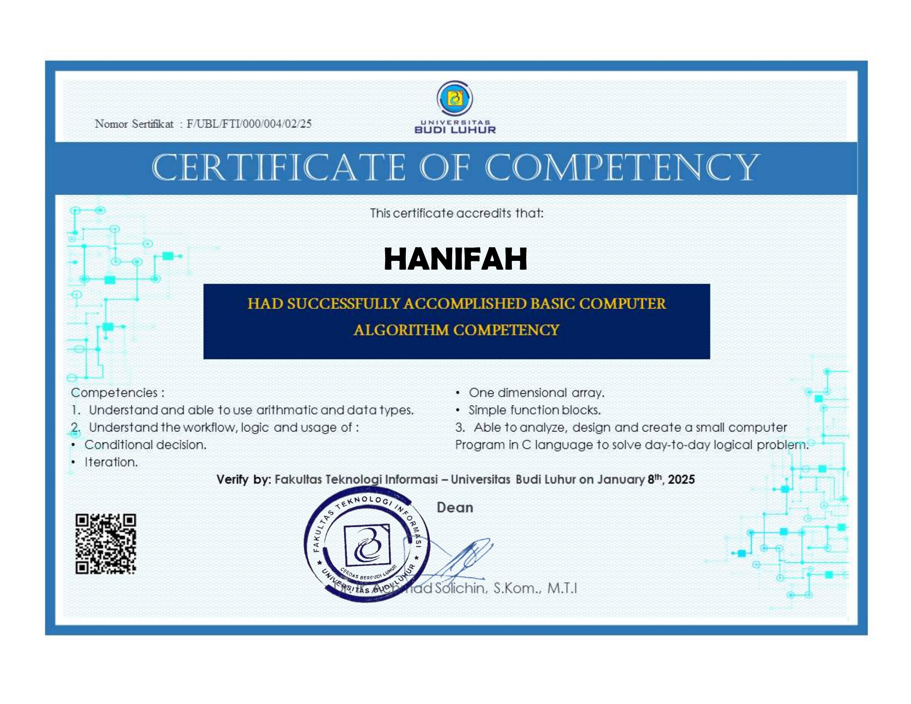
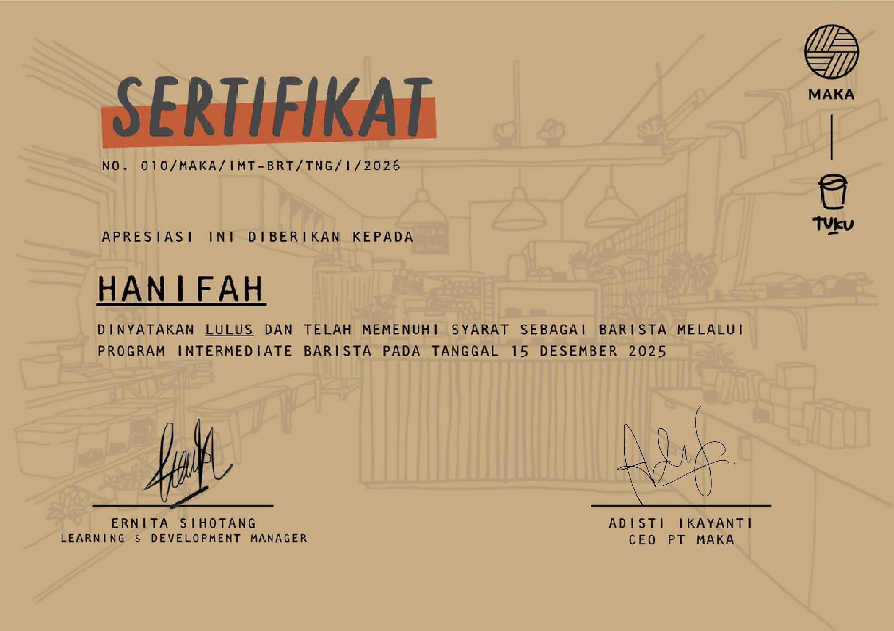

# Portofolio
My Portofolio

<!DOCTYPE html>
<html lang="en">
<head>
<meta charset="UTF-8">
<meta name="viewport" content="width=device-width, initial-scale=1.0">
<title>Hanifah | Portfolio</title>

</head>

<body>

<header>
    <h1>Hanifah</h1>
    <h3>"Where Logic Meets Latte"</h3>
    

        Beyond pulling shots, I apply my education background to streamline coffee operations. 
        I focus on making the bar run like a well-oiled machine—from maintaining precise 
        financial records and inventory to delivering a seamless experience for every customer.
    

</header>

<section>
    <h2>About Me</h2>
    

        

            I have hands-on experience in fast-paced operational environments, where I developed strong problem-solving,
            multitasking, and decision-making skills.
        

        

            With a background in <strong>Informatics Engineering</strong>, I am interested in using data and technology
            to improve business operations and efficiency.
        

    

</section>

<section>
    <h2>Education</h2>
    

        
<strong>Bachelor’s Degree in Computer Science (2025)</strong>

        
Budi Luhur University, Jakarta, Indonesia | GPA: 3.58

        

            Relevant Coursework: Data Analysis, Database Management, Information Systems, Basic Programming. 
            Developed skills in data processing, accuracy, and structured problem solving.
        

    

</section>

<section>
    <h2>Experience</h2>
    

        <h3>Barista & Ops — Toko Kopi Tuku (July 2022 – April 2026)</h3>
        
        
Commercial & Events:

        <ul style="padding-left: 20px; margin-bottom: 15px;">
            <li>Managed bulk orders and coffee activations for corporate/private events with high precision.</li>
            <li>Represented the brand in major exhibitions, handling booth operations and customer relations.</li>
            <li>Served as <b>PIC for 4 Cloud Kitchen outlets</b>, coordinating daily operations and team workflows.</li>
        </ul>

        
Operational & Finance (ERP System):

        <ul style="padding-left: 20px;">
            <li>Handled <b>PO processing and data entry via ERP system</b> with 100% data accuracy.</li>
            <li>Managed cash/cashless transactions, reconciliation, and daily sales reporting.</li>
            <li>Supervised inventory levels, petty cash tracking, and stock management.</li>
        </ul>
    

</section>

<section>
    <h2>Academic Projects</h2>
    

        

            <h3>Sales Data Encryption (AES-256)</h3>
            
Developed a secure web-based system to protect daily sales transaction data using AES-256 encryption.

            <ul style="margin-top:10px; padding-left: 20px;">
                <li>Implemented PHP-based AES-256 encryption/decryption</li>
                <li>Integrated MySQL for secure financial data storage</li>
                <li>Applied data security principles to sensitive records</li>
            </ul>
        

    

</section>

<section>
    <h2>Certifications</h2>
    

        

            

                <h3>Basic Computer Algorithm Competency</h3>
                
Universitas Budi Luhur

            

            <a href="#cert1" class="btn-cert">View ↗</a>
        

        

            

                <h3>Intermediate Barista Toko Kopi Tuku</h3>
                
Barista Academy

            

            <a href="#cert2" class="btn-cert">View ↗</a>
        

    

</section>

<section>
    <h2>Skills</h2>
    

        <h4 style="margin-bottom:10px;">Technical</h4>
        

            Microsoft Office
            PHP
            SQL (Basic)
            System Logic
            Networking
        

        <h4 style="margin-top:20px; margin-bottom:10px;">Core</h4>
        

            Problem Solving
            Operational Strategy
            Demand Forecasting
            Adaptability
        

    

</section>

     
    

        <a href="#" class="modal-close">&times;</a> 
        
        
Verified Basic Computer Algorithm Competency Certification

    

    
    

        <a href="#" class="modal-close">&times;</a>
        
        
Verified Intermediate Barista Toko Kopi Tuku Certification

    

<footer>
    
Contact Me

    

        <a href="mailto:hanifahneness@gmail.com">Email</a> | 
        <a href="https://www.linkedin.com/in/hanifahhan" target="_blank">LinkedIn</a> | 
        <a href="https://github.com/username-kamu" target="_blank">GitHub</a>
    

    
&copy; 2026 Hanifah Portfolio

</footer>

</body>
</html>
